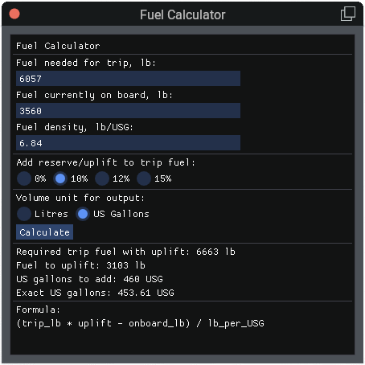

# Fuel Calculator

FlyWithLua script for X-Plane 12 that calculates how much fuel to uplift. Enter trip fuel and fuel on board in pounds, apply an optional reserve percentage, and get the volume to add in litres or US gallons. I fly the Challenger 650 frequently between the U.S. and Europe; so dealing with the interconversion between imperial and metric units become a hassle. Don't want another [Gimli Glider](https://en.wikipedia.org/wiki/Gimli_Glider).

---



## Installation

### Requirements

- X-Plane 12
- [FlyWithLua NG+](https://forums.x-plane.org/index.php?/files/file/38445-flywithlua-ng-next-gen-edition/) with floating-window / ImGui support (`SUPPORTS_FLOATING_WINDOWS`)

### Install the files

Copy the fuel calculator package into your FlyWithLua `Scripts` folder. The layout must look like this:

```
X-Plane 12/Resources/plugins/FlyWithLua/Scripts/
  fuel_calculator.lua
  README.md
  fuel_calculator/
    lib/
      core.lua
    tests/
      run_tests.lua
      core_spec.lua
```

**Important:**

- `fuel_calculator.lua` must sit directly in `Scripts/` (FlyWithLua only auto-loads `.lua` files in that folder).
- The `fuel_calculator/` subfolder holds the library and tests. Do not move `core.lua` to the top-level `Scripts/` folder.

### Load the script

FlyWithLua loads all scripts automatically when X-Plane starts. After copying or updating files:

1. Start X-Plane (or restart if it is already running).
2. Or, without restarting: **Plugins → FlyWithLua → Reload all Lua script files**.

Check the X-Plane `Log.txt` for:

```
FlyWithLua Info: Finished loading script file .../fuel_calculator.lua
```

If the script fails to load, FlyWithLua may move it to `Scripts (Quarantine)/`. See [Debugging](#debugging) below.

### Optional: run unit tests (before flying)

From a terminal, with Lua installed:

```bash
lua "/path/to/X-Plane 12/Resources/plugins/FlyWithLua/Scripts/fuel_calculator/tests/run_tests.lua"
```

On macOS with Homebrew Lua:

```bash
/opt/homebrew/bin/lua "/Volumes/ThunderBay/X-Plane 12/Resources/plugins/FlyWithLua/Scripts/fuel_calculator/tests/run_tests.lua"
```

All tests should pass before you rely on the calculator in-sim.

---

## Usage

### Open the calculator

**From the FlyWithLua menu**

1. In X-Plane, open **Plugins → FlyWithLua → Macro**.
2. Click **Fuel Calculator**.

The window opens each time you select this item. There is no on/off toggle — closing and reopening is handled cleanly.

**From a key or button (optional)**

1. Open **Settings → Keyboard** (or **Joystick**).
2. Search for **Toggle Fuel Calculator** (command: `FlyWithLua/fuel_calculator/toggle`).
3. Assign a key or button.

This command toggles the window open and closed.

### Enter your numbers

| Field | Unit | Notes |
|---|---|---|
| Fuel needed for trip | lb | Trip burn from your flight plan or FMS |
| Fuel currently on board | lb | Fuel in tanks now |
| Fuel density | kg/L or lb/USG | Depends on volume unit selected (see below) |

### Add reserve / uplift

Select one of the radio buttons to add a percentage **on top of trip fuel**:

- **0%** — trip fuel only
- **10%**, **12%**, **15%** — common reserve/uplift margins

Example: trip 13,504 lb with **+12%** → required fuel = 13,504 × 1.12 = **15,124 lb**.

### Choose volume unit

| Output | Density field | Typical Jet A value |
|---|---|---|
| **Litres** | kg/L | `0.819` |
| **US Gallons** | lb/USG | `6.84` |

The density label changes automatically when you switch units. Enter the value in the units shown — do not convert manually.

### Read the results

After entering values (the calculator updates automatically as you type):

- **Required trip fuel with uplift** — trip fuel after the selected percentage
- **Fuel to uplift** — pounds still needed after subtracting fuel on board
- **Litres to add** / **US gallons to add** — rounded **up** to the nearest 10
- **Exact litres** / **Exact US gallons** — unrounded volume

If onboard fuel already exceeds the required total, **Fuel to uplift** shows 0.

### Close the calculator

Click the red **close** button on the window title bar.

You can reopen it anytime from **Plugins → FlyWithLua → Macro → Fuel Calculator** without reloading scripts.

### Worked example

| Input | Value |
|---|---|
| Trip fuel | 13,504 lb |
| On board | 10,790 lb |
| Uplift | +12% |
| Density | 0.819 kg/L |
| Output unit | Litres |

| Result | Value |
|---|---|
| Required with uplift | 15,124 lb |
| Fuel to uplift | 4,334 lb |
| Exact litres | ~2,400.59 L |
| **Litres to add** | **2,410 L** (rounded up) |

---

## Running unit tests

Plain Lua runner (no extra dependencies):

```bash
lua "Scripts/fuel_calculator/tests/run_tests.lua"
```

With Busted (after `luarocks install busted`):

```bash
cd Scripts/fuel_calculator
busted tests/
```

Tests cover all uplift percentages (0%, 10%, 12%, 15%), metric and imperial volume, validation errors, and rounding. They run outside X-Plane and do not require FlyWithLua.

---

# FlyWithLua Script Patterns

Technical reference for building FlyWithLua NG+ scripts in X-Plane 12, based on the fuel calculator implementation. Use this when creating new scripts so they behave reliably across open, close, reload, and menu interaction.

## Directory layout

FlyWithLua only auto-loads `.lua` files in the top-level `Scripts/` folder. Subfolders are not executed automatically, which makes them safe for libraries, tests, and docs.

```
Scripts/
  my_script.lua                    # Entry point (loaded by FlyWithLua)
  README.md                        # Optional: installation, usage, developer notes
  my_script/
    lib/
      core.lua                     # Pure logic, no ImGui / FlyWithLua APIs
    tests/
      run_tests.lua                # Plain Lua test runner
      core_spec.lua                # Optional Busted specs
```

**Naming rule:** keep shared folders (`lib/`, `tests/`) inside a script-specific directory (`fuel_calculator/`, `pause_near/`, etc.) so multiple scripts never collide.

## Entry point vs package code

| Layer | File | Responsibility |
|---|---|---|
| Entry point | `Scripts/fuel_calculator.lua` | FlyWithLua registration, ImGui UI, window lifecycle |
| Core | `fuel_calculator/lib/core.lua` | Pure calculations, unit-testable |
| Tests | `fuel_calculator/tests/` | Run outside X-Plane with standalone Lua |

Load the core module from the entry point using an explicit path:

```lua
local SCRIPT_DIR = SCRIPT_DIRECTORY .. "fuel_calculator" .. DIRECTORY_SEPARATOR

local function load_core()
    local core_path = SCRIPT_DIR .. "lib" .. DIRECTORY_SEPARATOR .. "core.lua"
    local chunk, load_err = loadfile(core_path)
    if chunk == nil then
        logMsg("Fuel Calculator: failed to load core module: " .. tostring(load_err))
        return nil
    end

    local ok, core = pcall(chunk)
    if not ok then
        logMsg("Fuel Calculator: failed to run core module: " .. tostring(core))
        return nil
    end

    return core
end

local core = load_core()
```

Use `loadfile` + `pcall` rather than bare `dofile` so load failures are logged and the UI can show a fallback message instead of failing silently.

## Global naming

Functions referenced by FlyWithLua **command strings** or **macro strings** must be global:

```lua
-- Works with add_macro / create_command strings
function fuel_calculator_show_window() ... end

-- Does NOT work when passed as a string
local function show_window() ... end
```

Prefix globals with the script name (`fuel_calculator_*`, `paw_*`) to avoid clashes between scripts in the same Lua VM.

Keep mutable state as `local` variables in the entry-point file. Only callbacks registered by name need to be global.

## Floating window lifecycle

### Create and show

```lua
local win = nil

function my_script_show_window()
    if win ~= nil then
        local ok, visible = pcall(float_wnd_get_visible, win)
        if ok and visible then
            return  -- already open
        end
        win = nil     -- stale handle after red-X close
    end

    win = float_wnd_create(430, 400, 1, true)
    float_wnd_set_title(win, "My Script")
    float_wnd_set_imgui_builder(win, my_script_draw_window)
    float_wnd_set_onclose(win, "my_script_on_close")
end
```

### Draw callback

Pass the draw function **by reference** (not a string):

```lua
float_wnd_set_imgui_builder(win, my_script_draw_window)   -- good
float_wnd_set_imgui_builder(win, "my_script_draw_window") -- also works if global
```

The draw function runs every frame while the window is open. Do not call ImGui outside this callback (except in the on-close handler, where ImGui is forbidden).

### Close via red X

Pass the on-close handler **by global name string**:

```lua
float_wnd_set_onclose(win, "my_script_on_close")  -- good

function my_script_on_close(wnd)
    win = nil
    -- Window is already destroyed. Do not call imgui or float_wnd_* here.
end
```

**Why the string matters:** FlyWithLua resolves some callbacks by global name at runtime. A function reference may work for `float_wnd_set_imgui_builder` but is unreliable for `float_wnd_set_onclose`. Use a global function name string for on-close.

### Hide programmatically

```lua
function my_script_hide_window()
    if win ~= nil then
        float_wnd_destroy(win)
        win = nil
    end
end
```

### Stale window handles

When the user clicks the red close button, FlyWithLua destroys the window. If the on-close callback does not run (or was not registered correctly), `win` still holds a non-nil handle and `show_window` will refuse to create a new window.

Always guard with visibility check + reset:

```lua
if win ~= nil then
    local ok, visible = pcall(float_wnd_get_visible, win)
    if ok and visible then
        return
    end
    win = nil
end
```

`pcall` protects against invalid handles left over from a destroyed window.

## Macro menu vs toggle command

### Use a single-action macro for "open window" scripts

```lua
add_macro("Fuel Calculator", "fuel_calculator_show_window()")
```

Every menu click runs the show function. There is no on/off state to get stuck.

This matches `pause_near.lua` and avoids a common failure mode with toggle macros.

### Avoid toggle macros for floating windows

```lua
-- Problematic pattern for window scripts
add_macro("My Script", "show()", "hide()", "deactivate")
```

FlyWithLua toggle macros track an active/inactive state (the dot in the menu). When the user closes the window with the red X:

1. The macro may still show as **active**.
2. The next menu click runs the **deactivate** action (`hide`) instead of `show`.
3. `hide` does nothing because the window is already gone.
4. The user must reload scripts to recover.

`activate_macro()` / `deactivate_macro()` in the on-close handler are intended to sync state, but they are not dependable enough to rely on for this pattern.

### Use a command for true toggle behaviour

```lua
create_command(
    "FlyWithLua/fuel_calculator/toggle",
    "Toggle Fuel Calculator",
    "fuel_calculator_toggle_window()",
    "",
    ""
)
```

Toggle logic must also handle stale handles:

```lua
function fuel_calculator_toggle_window()
    if win ~= nil then
        local ok, visible = pcall(float_wnd_get_visible, win)
        if ok and visible then
            fuel_calculator_hide_window()
            return
        end
        win = nil
    end

    fuel_calculator_show_window()
end
```

Bind the command to a key or joystick button in X-Plane settings. The macro menu remains a simple "open" action.

## Separating testable logic

Keep `lib/core.lua` free of FlyWithLua globals (`imgui`, `float_wnd_create`, `SCRIPT_DIRECTORY`, etc.). It should return a module table:

```lua
local M = {}

function M.calculate(...) ... end

return M
```

See [Running unit tests](#running-unit-tests) above for commands.

## Lua pitfalls in FlyWithLua

### Multiple return values and error strings

```lua
-- BAD: on success, calculate() returns one value, so err becomes nil
result, error_message = core.calculate(...)
if error_message ~= "" then  -- nil ~= "" is true!
    imgui.TextUnformatted(error_message)  -- crashes: TextUnformatted(nil)
end

-- GOOD
local result, calc_error = core.calculate(...)
if result ~= nil then
    error_message = ""
else
    error_message = calc_error or "Calculation failed."
end
```

### String command callbacks need global functions

```lua
add_macro("Fuel Calculator", "fuel_calculator_show_window()")
create_command("FlyWithLua/fuel_calculator/toggle", "...", "fuel_calculator_toggle_window()", "", "")
```

All named functions must exist in the global table when FlyWithLua executes the string.

### Scripts stay loaded

Closing the window does **not** unload the script. FlyWithLua keeps all `Scripts/*.lua` files in memory until:

- **Plugins → FlyWithLua → Reload all Lua script files**, or
- X-Plane restarts.

That is normal. The goal is for the window and menu to remain usable without a reload.

## Checklist for a new floating-window script

1. Create `Scripts/my_script.lua` (entry point) and `Scripts/my_script/lib/core.lua`.
2. Prefix all global callbacks: `my_script_show_window`, `my_script_draw_window`, `my_script_on_close`.
3. Guard `SUPPORTS_FLOATING_WINDOWS` at the top; `return` early if unsupported.
4. Store the window handle in a local `win` variable; set `win = nil` in on-close.
5. Register on-close with a **global name string**.
6. Pass imgui builder by **function reference**.
7. Check `float_wnd_get_visible` before reusing `win`; clear stale handles.
8. Use a **single-action** `add_macro` for the menu.
9. Use `create_command` for optional toggle via key binding.
10. Keep calculations in `lib/` and add tests under `my_script/tests/`.
11. Reload FlyWithLua once after changes; close any old window before testing.

## Debugging

If a window is blank or will not reopen:

1. Check `FlyWithLua_Debug.txt` in the X-Plane root folder for Lua errors during draw.
2. Confirm the script loaded without quarantine (`Scripts (Quarantine)/`).
3. Verify `win` is `nil` after closing (stale-handle symptom: show does nothing).
4. Verify the macro is single-action, not a stuck toggle (dot still showing after red-X close).
5. Run unit tests to isolate logic bugs from UI/window issues.

## Fuel calculator specifics

| Item | Value |
|---|---|
| Macro | `Fuel Calculator` → always opens window |
| Command | `FlyWithLua/fuel_calculator/toggle` |
| Trip/onboard units | lb |
| Metric density | kg/L (default 0.819) |
| Imperial density | lb/USG (default 6.84) |
| Volume output | litres or US gallons |
| Rounding | always up to nearest 10 in the selected volume unit |
